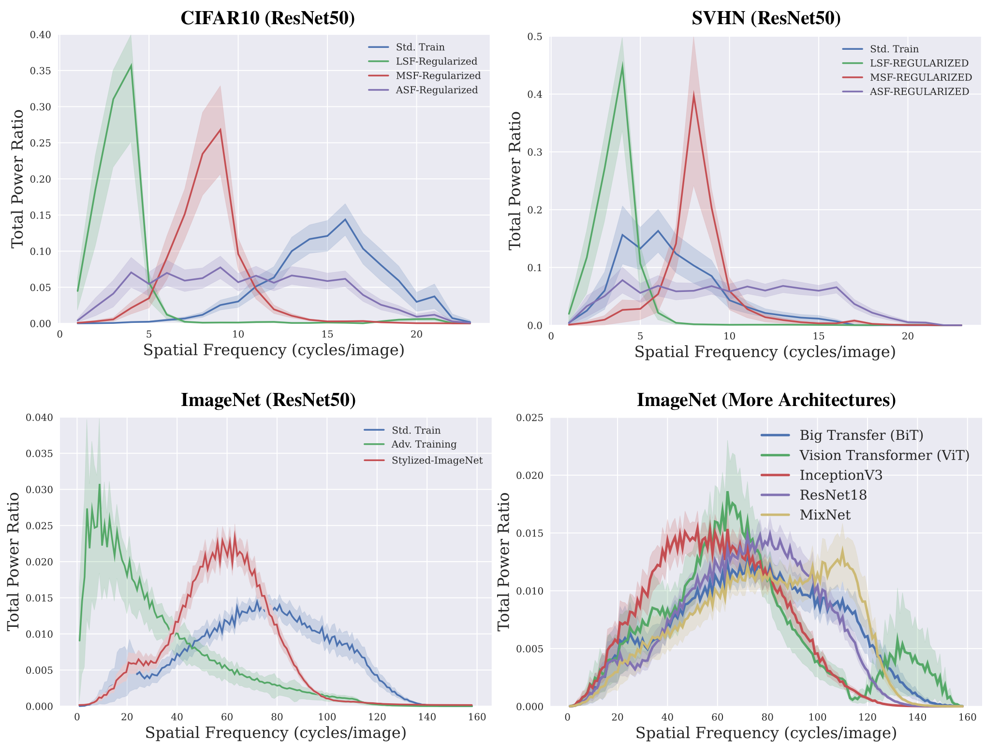

## Fourier Sensitivity and Regularization of Computer Vision Models

This repository contains code for work presented in [Fourier Sensitivity and Regularization of Computer Vision Models](https://openreview.net/forum?id=VmTYgjYloM), published at TMLR 2022. Fourier Sensitivity of computer vision models is based on a rigorously defined measure of sensitivity
to input frequencies. Please see the paper for details.

<!--  -->


## Installing libraries
The code was run with Python3.8
```
pip install -r requirements.txt
```

## Generating Fourier Sensitivity plots
Please see the jupyter notebook "Fourier-Sensitivity.ipynb" for examples of plotting the Fourier Sensitivity of pre-trained models. 
Run all cells to re-generate the plots (be sure to change the path to the dataset, i.e., PATH\_TO\_IMAGENET)

## Fourier Regularized training
We have provided a reference implementation of Fourier-regularized training on CIFAR10 (train.py). Please use the commands below. 
```
# standard training (CIFAR10)
python train.py

# Fourier-regularized training (CIFAR10)
python train.py --regularizer {LSF,MSF,HSF,ASF} --regularier_lambda 0.5
```

## Acknowledgement
CIFAR10 training code is based on https://github.com/kuangliu/pytorch-cifar

